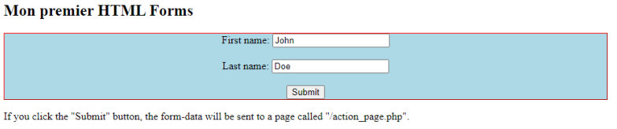

## Lesson 1: Creating Your First HTML Page

In this lesson, you'll create a basic HTML page using Laragon and Visual Studio Code. We'll focus on the essentials of HTML and applying simple CSS styles.

### Getting Started

1. **Project Setup:**

   a. Launch Laragon and create a new "Blank" project named "Lesson1"
   
   b. Open the "www" folder in Laragon, then navigate to the "Lesson1" directory.

2. **Setting Up Visual Studio Code:**

   a. Open Visual Studio Code.

   b. Open the "tp1" folder by pointing to `c:\laragon\www\tp1`.

   c. Create a new file named "welcome.html" and type `<!DOCTYPE>`, then press `Ctrl+Space` to select "HTML sample."

## Your First HTML Page

1. Create a new file named "index.html" and add the following code:
```html
<!DOCTYPE>
<html>
    <body>
        <h1>Write Your First Heading</h1>
        <p>Write Your First Paragraph.</p>
    </body>
</html>
```

2. Modify the code to change the heading and paragraph styles:
```html
<h1 style="color:blue;">A Blue Heading</h1>
<p style="color:red;">A red paragraph.</p>
```

3. Add this code to a new file
```html
<!DOCTYPE html>
<html>
    <head>
        <style>
            body {background-color: powderblue;}
            h1 {color: blue;}
            p {color: red;}
        </style>
    </head>
    <body>
        <h1>This is a heading</h1>
        <p>This is a paragraph.</p>
    </body>
</html>
```

4. Add this code to a new file
```html
<!DOCTYPE html>
<html>
    <head>
        <title></title>
    </head>
    <body>
        <p>Click on <a href="https://www.google.com/" target="_blank"> thislink </a>to go on home page of google.</p>
    </body>
</html>
```

5. add this code to a new file
```html
<!DOCTYPE html>
<html>
    <body>
        <h2>HTML Forms</h2>
        <form action="/action_page.php">
            <label for="fname">First name:</label><br>
            <input type="text" id="fname" name="fname" value="John"><br>
            <label for="lname">Last name:</label><br>
            <input type="text" id="lname" name="lname" value="Doe"><br><br>
            <input type="submit" value="Submit">
        </form>
        <p>If you click the "Submit" button, the form-data will be sent to a page called
        "/action_page.php".</p>
    </body>
</html>
```

6. add this code to a new file
```html
<!DOCTYPE html>
<html>
    <body>
        <div style="background-color:black;color:white;padding:20px;">
            <h2>London</h2>
            <p>London is the capital city of England. It is the most populous city in the United Kingdom, with a
            metropolitan area of over 13 million inhabitants.</p>
            <p>Standing on the River Thames, London has been a major settlement for two millennia, its history
            going back to its founding by the Romans, who named it Londinium.</p>
        </div>
    </body>
</html>
```

7. Combine the code from instruction 1 to 6 to have the following interface:

